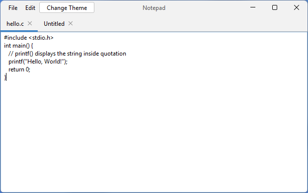
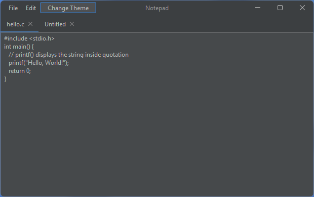
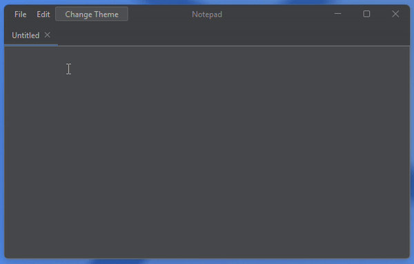
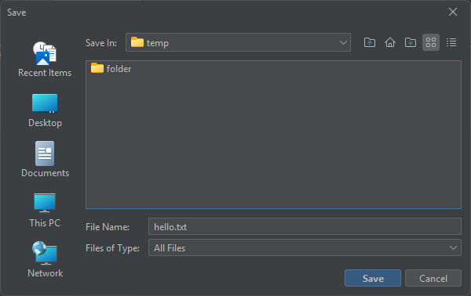

# Notepad App

## Overview

This project was made for my Java Programming course at uni.

This Notepad App is a simple text editor application designed to help users create and manage text documents efficiently. 
It provides essential features such as creating, opening, saving, and editing text files, as well as undo and redo functionalities.

## Features

- **Tabs:** Organize your work with multiple tabs, allowing you to switch between different documents seamlessly.
- **File Operations:** Create, open, save, and manage text files with ease.
- **Undo and Redo:** Correct mistakes or redo actions with the built-in undo and redo functionalities.
- **Dark Mode:** Toggle between light and dark modes for a comfortable writing experience.

## Getting Started

### Prerequisites

- JDK 17 installed on your machine.
- Clone the repository to your local environment.

### Build and Run

1. Open a terminal and navigate to the project's root directory.
2. Build the project using Maven:

   ```bash
   ./mvnw.cmd clean install

3. Run the application with
    ```bash
   java -cp "target/*" papplevaa.notepad.Main

## Contact

For any issues, please contact me at [papp.levente2003@gmail.com](papp.levente2003@gmail.com).

## Screenshots in action

### Light theme


### Dark theme


### Undo-redo capabilities


### Save
